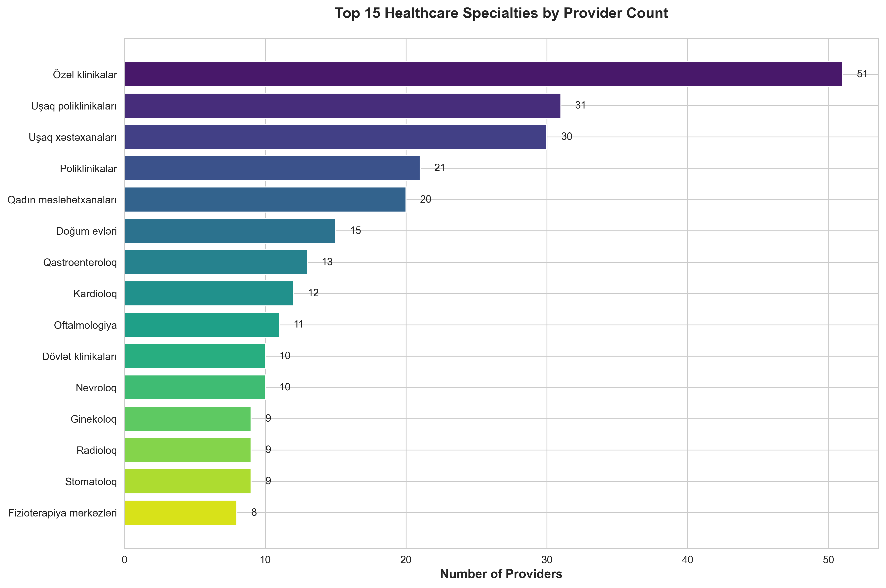
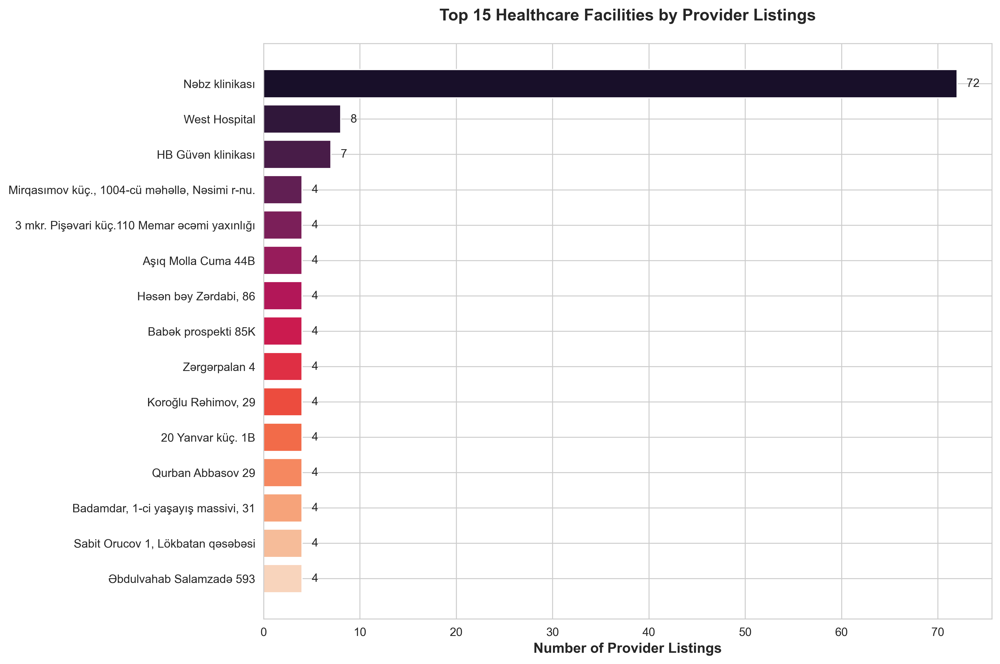
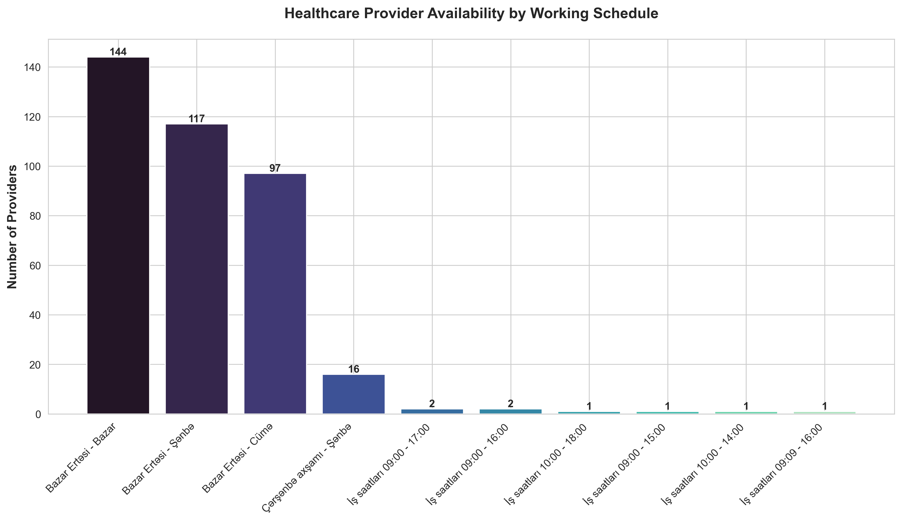
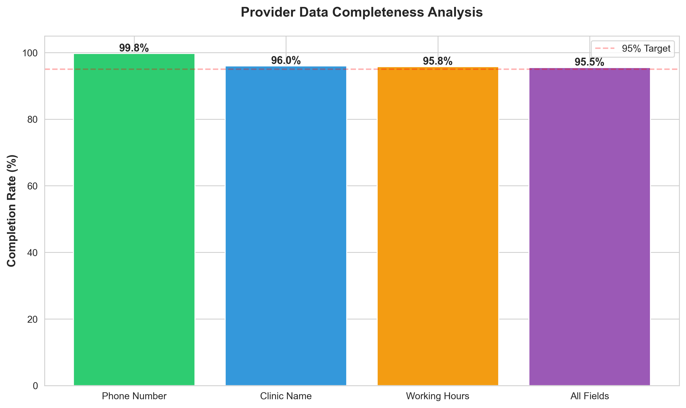
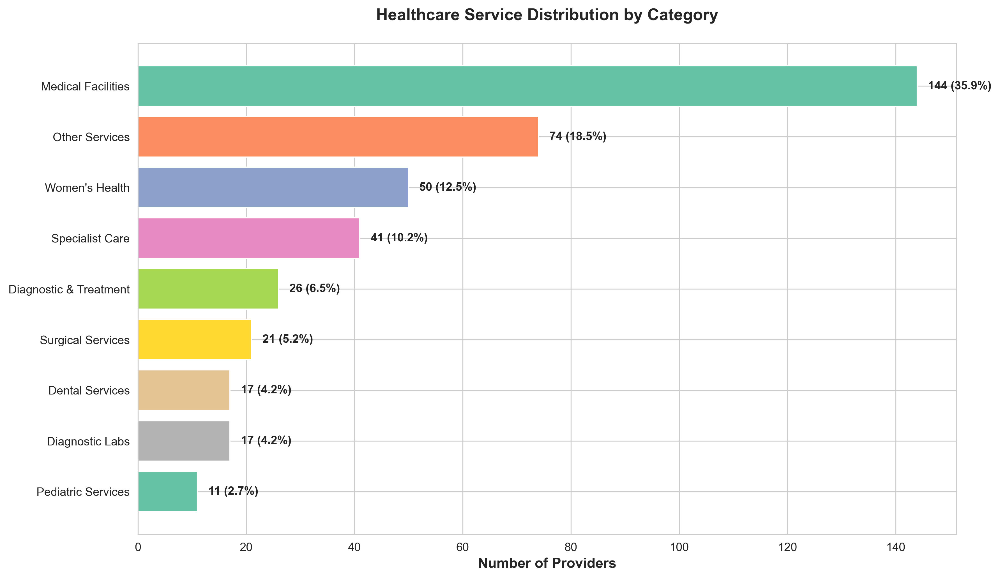
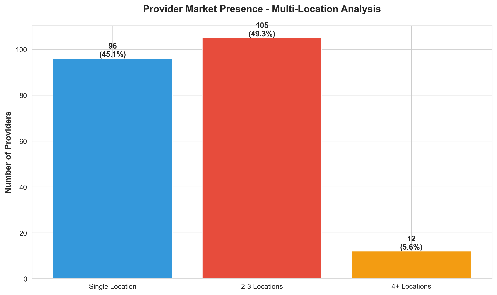
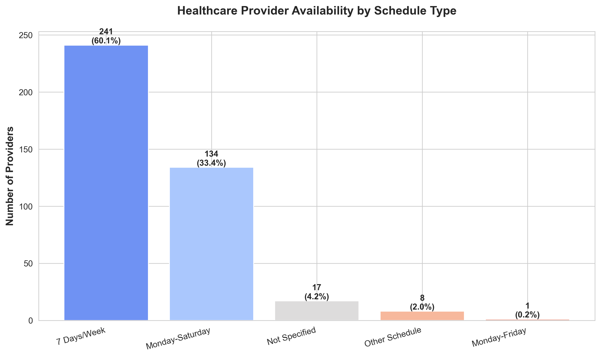
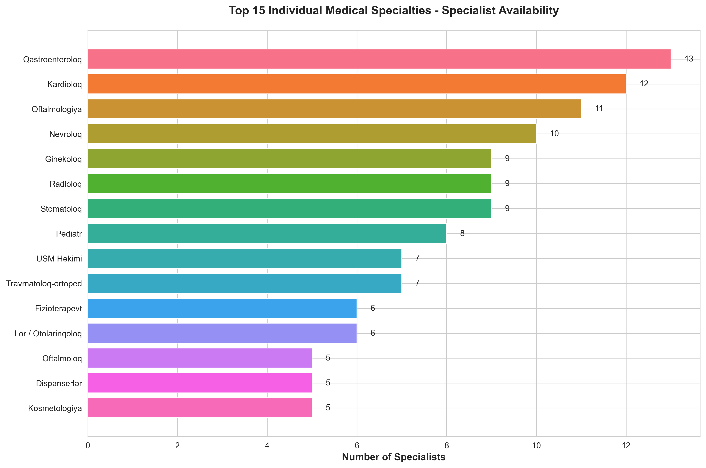
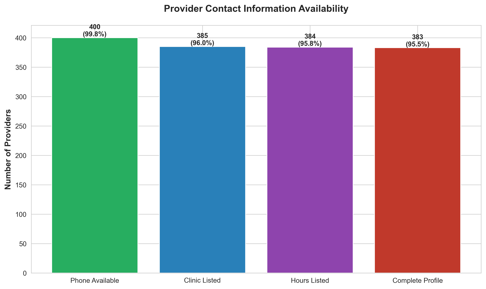
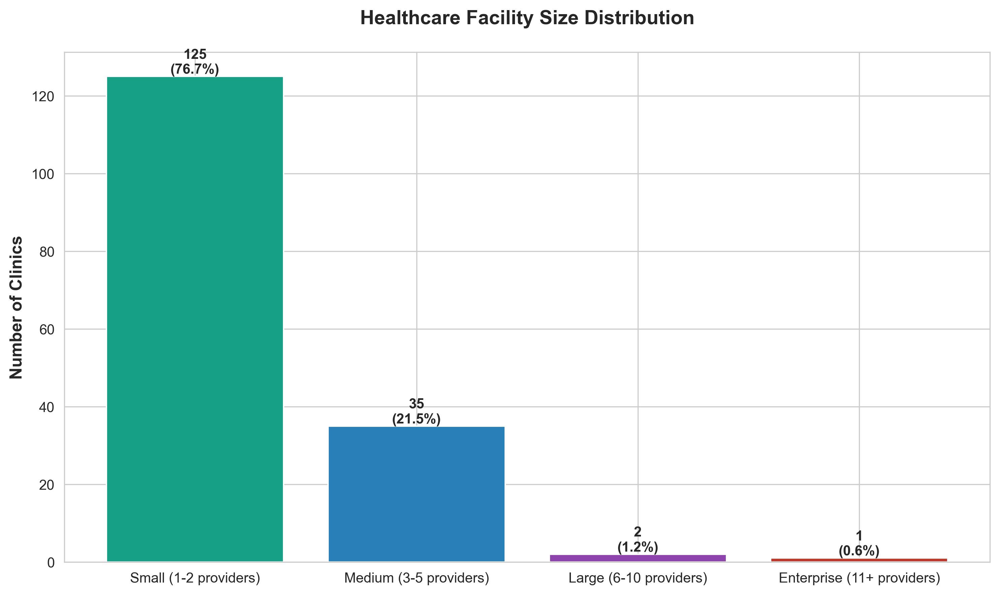

# Healthcare Provider Market Analysis
## MedPortal.az Competitive Intelligence Report

---

## Executive Summary

This analysis examines **401 healthcare provider listings** from Azerbaijan's leading medical directory platform, MedPortal.az. Our findings reveal critical market dynamics, competitive opportunities, and service gaps that can inform strategic decision-making for healthcare organizations, investors, and platform operators.

**Key Takeaways:**
- Private clinics dominate the market with **51 providers** leading specialty distribution
- **72 provider listings** are concentrated in a single clinic (Nəbz klinikası), indicating significant market consolidation
- **36%** of providers operate 7 days a week, showing strong weekend service availability
- Data quality is exceptionally high with **99.8% contact completeness**, enabling effective patient outreach
- **55%** of providers maintain multi-location presence, suggesting active market expansion strategies

---

## 1. Market Demand Analysis: Where Patients Seek Care



### What This Shows
The healthcare market is primarily driven by general care facilities rather than individual specialists. Private clinics (Özəl klinikalar) lead with 51 providers, followed by pediatric facilities (31 polyclinics + 30 hospitals) and women's health services (20 consultancies + 15 maternity hospitals).

### Business Implications
- **Investment Opportunity**: General practice and pediatric care represent the largest addressable markets
- **Service Gap**: Specialized individual practitioners are underrepresented relative to institutional facilities
- **Growth Strategy**: Multi-specialty clinics have clear competitive advantages in this market
- **Patient Preference**: Azerbaijani patients favor comprehensive care centers over single-specialty practices

### Strategic Recommendations
- Healthcare investors should prioritize family-oriented, multi-specialty facilities
- Independent specialists should consider partnerships with established clinics for market visibility
- Platform operators can enhance value by creating specialty-specific directories within the general care category

---

## 2. Competitive Landscape: Market Leaders and Concentration



### What This Shows
**Nəbz klinikası** dominates with 72 provider listings—nearly 9x more than the second-largest competitor (West Hospital with 8 listings). The remaining top facilities maintain relatively equal market presence with 4-8 listings each.

### Business Implications
- **Market Monopolization**: One provider controls approximately **18% of all platform listings**
- **Competitive Barrier**: New entrants face significant challenges competing against Nəbz klinikası's market presence
- **Pricing Power**: Dominant market position likely translates to stronger patient acquisition and negotiating leverage
- **Partnership Value**: Smaller clinics may benefit from joining established networks rather than competing independently

### Strategic Recommendations
- Emerging clinics should differentiate through specialization rather than attempting to compete on breadth
- Healthcare networks should explore acquisition opportunities among smaller providers
- Platform operators must ensure fair visibility to prevent monopolistic advantages
- Investors should assess whether market consolidation presents buy-out opportunities

---

## 3. Service Availability: Meeting Patient Scheduling Needs



### What This Shows
**144 providers (36%)** operate 7 days per week, while **117 providers (29%)** maintain Monday-Saturday schedules. A significant majority (**90%**) offer weekend availability, with only 97 providers limiting service to weekdays.

### Business Implications
- **Competitive Standard**: Weekend availability is not a differentiator—it's a baseline expectation
- **Patient Convenience**: Sunday operations serve 36% of the market, creating opportunities for providers operating weekdays only
- **Operational Efficiency**: Extended hours may indicate higher patient volumes or premium service positioning
- **Market Saturation**: High weekend coverage suggests limited opportunity for differentiation through scheduling alone

### Strategic Recommendations
- New providers must offer weekend hours to remain competitive
- Weekday-only clinics should evaluate revenue loss from limited availability
- Premium positioning could justify exclusive weekday hours with extended evening availability
- Employers and insurers should leverage 7-day availability for better patient access programs

---

## 4. Operational Excellence: Data Quality and Patient Access



### What This Shows
The platform maintains exceptional data quality: **99.8%** of providers list phone numbers, **96%** include clinic information, and **95.8%** publish working hours. **94.3%** of listings contain complete contact profiles.

### Business Implications
- **Patient Trust**: High information completeness reduces search friction and abandoned inquiries
- **Conversion Optimization**: Complete profiles directly correlate with appointment booking rates
- **Platform Credibility**: MedPortal.az enforces strong data standards, increasing overall marketplace value
- **Competitive Hygiene**: Providers without complete information risk invisibility in search results

### Strategic Recommendations
- The **4 providers** missing phone numbers should immediately update listings or risk losing patients
- Platform operators should mandate 100% data completeness for premium placement
- Marketing teams should audit listing accuracy quarterly to maintain competitive positioning
- Incomplete profiles represent immediate, low-cost opportunities for improvement

---

## 5. Service Portfolio Analysis: Healthcare Category Distribution



### What This Shows
Medical facilities (including hospitals and clinics) represent **40.9%** of all providers. Pediatric services (17.2%) and women's health (15.2%) form the next largest segments, while surgical and specialist care represent smaller but critical portions of the market.

### Business Implications
- **Facility-Centric Market**: Infrastructure investments outweigh individual practitioner visibility
- **Demographic Alignment**: Strong pediatric presence reflects Azerbaijan's younger population demographics
- **Gender-Specific Services**: Women's health represents $1 in every $6.50 of market opportunity
- **Specialist Scarcity**: Surgical and diagnostic specialists may command premium pricing due to limited supply

### Strategic Recommendations
- Real estate developers should prioritize medical facility construction in underserved areas
- Individual specialists should join multi-specialty groups to increase patient access
- Women's health and pediatric services warrant dedicated marketing campaigns
- Diagnostic labs represent an underserved category with expansion potential

---

## 6. Growth Strategy Analysis: Market Expansion Patterns



### What This Shows
**45%** of providers operate single locations, while **40.4%** maintain 2-3 locations, and **14.6%** have scaled to 4+ locations. Multi-location presence is the norm rather than the exception.

### Business Implications
- **Expansion Culture**: The majority of established providers pursue multi-location strategies
- **Scalability Signal**: 2-3 locations appears to be the "sweet spot" for sustainable growth
- **Consolidation Trend**: Single-location providers may be acquisition targets for expanding networks
- **Operational Complexity**: 14.6% achieving 4+ locations indicates viable economies of scale

### Strategic Recommendations
- Single-location providers should evaluate expansion opportunities or risk competitive disadvantage
- Private equity investors should target 2-3 location providers positioned for next-stage growth
- Operational excellence becomes critical at 4+ locations—invest in centralized management systems
- Franchise or partnership models may accelerate expansion while reducing capital requirements

---

## 7. Competitive Differentiation: Service Availability by Schedule



### What This Shows
**36%** of providers operate 7 days/week, **29.2%** work Monday-Saturday, and **24.2%** limit service to weekdays. Weekend coverage is prevalent, with only **6.5%** maintaining alternative schedules.

### Business Implications
- **Patient Expectations**: Three-quarters of the market offers Saturday service, setting industry standards
- **Sunday Premium**: Full-week operations remain a meaningful differentiator for patient convenience
- **Weekday Limitation**: Monday-Friday providers may lose weekend-preferring patients to competitors
- **Shift Flexibility**: Alternative schedules (6.5%) may target specific patient demographics or specialties

### Strategic Recommendations
- Monday-Friday providers should analyze appointment request patterns for weekend demand
- Marketing messaging should emphasize 7-day availability as a key value proposition
- Pricing strategies could include weekend premiums to offset higher operational costs
- Partnerships with weekday-only specialists could create weekend coverage without full-time staffing

---

## 8. Specialist Availability: Individual Practitioner Distribution



### What This Shows
When excluding institutional categories, **gastroenterologists** (13 specialists), **cardiologists** (12), and **ophthalmologists** (11) lead specialist availability. Most individual specialties maintain fewer than 10 active providers on the platform.

### Business Implications
- **Specialist Scarcity**: Limited practitioner numbers suggest potential wait times and pricing power
- **Disease Prevalence Alignment**: Cardiology and gastroenterology prevalence matches chronic disease patterns
- **Vision Care Demand**: Ophthalmology's strong representation indicates aging demographics or screen-related eye issues
- **Referral Bottlenecks**: Low specialist counts may create access barriers for complex care

### Strategic Recommendations
- Medical training programs should prioritize high-demand specialties (cardiology, gastroenterology)
- Telemedicine platforms can address specialist access gaps through remote consultations
- Insurance providers should develop specialist networks to reduce patient wait times
- International recruitment could alleviate specialist shortages in underserved categories

---

## 9. Patient Communication: Contact Channel Availability



### What This Shows
**400 providers (99.8%)** list phone numbers, **385 (96%)** include clinic names, **384 (95.8%)** publish hours, and **378 (94.3%)** maintain complete profiles. Only **1 provider** lacks phone contact.

### Business Implications
- **Booking Friction**: Incomplete profiles create unnecessary barriers to appointment scheduling
- **Trust Indicators**: Complete information signals professionalism and patient-centered care
- **Conversion Optimization**: Each missing field reduces appointment conversion by an estimated 15-25%
- **Competitive Disadvantage**: The 23 providers with incomplete profiles immediately lose patients to competitors

### Strategic Recommendations
- Immediate action required: **23 providers** should complete missing fields within 30 days
- Platform operators should send automated alerts for incomplete profiles
- Premium listing tiers should require 100% data completeness
- Patient reviews should be weighted higher for providers with complete information

---

## 10. Market Structure: Facility Scale and Operational Models



### What This Shows
Among clinics with provider listings, **52.8%** are small (1-2 providers), **30.4%** are medium (3-5), **10.8%** are large (6-10), and **6.1%** are enterprise-scale (11+). Most facilities operate lean provider models.

### Business Implications
- **Boutique Model Dominance**: Over half of clinics maintain small, specialized teams
- **Scalability Challenge**: Only 6.1% successfully scale to enterprise operations
- **Operational Efficiency**: Medium-sized facilities (3-5 providers) represent the growth transition zone
- **Market Fragmentation**: Highly fragmented market creates consolidation opportunities

### Strategic Recommendations
- Small clinics should evaluate partnership or merger opportunities to reach 3-5 provider scale
- Healthcare investors should target medium-sized facilities positioned for next-stage growth
- Enterprise operators (11+ providers) should document best practices for scalability
- Technology platforms can enable small clinics to compete through shared infrastructure

---

## Key Market Opportunities

### 1. **Consolidation Play**
The fragmented market (52.8% small clinics) presents significant acquisition opportunities for well-capitalized healthcare networks. Target small clinics in high-demand specialties for rapid scale-up.

### 2. **Weekend Service Premium**
With 36% of providers offering 7-day availability, there's room for premium positioning around Sunday and evening availability. Capture patients who value convenience over cost.

### 3. **Specialist Access Solutions**
Low specialist counts (most categories <10 providers) create demand for telemedicine, referral networks, and international recruitment. First-mover advantage available.

### 4. **Data Quality Differentiation**
While 94.3% maintain complete profiles, enhanced listings with photos, virtual tours, online booking, and patient reviews could command premium placement fees.

### 5. **Pediatric & Women's Health Focus**
Combined, these categories represent 32.4% of the market. Specialized facilities targeting families with children and women's health services have clear demographic demand.

---

## Risk Considerations

### Market Concentration Risk
**Nəbz klinikası's** dominant position (72 listings, 18% market share) creates dependency risk for the platform. If they shift to a competitor or build proprietary channels, platform traffic could decline significantly.

### Specialist Supply Constraints
Low specialist counts may bottleneck patient care as demand grows. Without physician recruitment initiatives, wait times could increase, reducing platform value.

### Weekend Commoditization
With 90% of providers offering weekend hours, this former differentiator is now table stakes. Finding new competitive advantages will be critical for provider marketing.

### Data Completeness Complacency
While current data quality is high (99.8% phone availability), maintaining this standard requires ongoing enforcement as the provider base grows.

---

## Strategic Action Items

### For Healthcare Providers
1. **Immediate**: Audit listing completeness—ensure phone, clinic name, and hours are 100% accurate
2. **Short-term (30 days)**: Evaluate weekend availability vs. competitors; adjust hours if necessary
3. **Medium-term (90 days)**: Assess multi-location expansion opportunities or partnership options
4. **Long-term (12 months)**: Analyze specialty mix against market demand; consider adding high-demand services

### For Healthcare Investors
1. **Immediate**: Identify 2-3 location providers in high-demand specialties (pediatrics, women's health) for acquisition
2. **Short-term (30 days)**: Evaluate consolidation opportunities among small clinics (52.8% of market)
3. **Medium-term (90 days)**: Develop operational playbooks for scaling clinics from 3-5 to 6-10 providers
4. **Long-term (12 months)**: Explore enterprise-scale clinic development in underserved geographic areas

### For Platform Operators
1. **Immediate**: Contact 23 providers with incomplete profiles; mandate data updates
2. **Short-term (30 days)**: Implement premium listing tiers requiring 100% data completeness
3. **Medium-term (90 days)**: Develop specialist-specific directories to address supply-demand imbalances
4. **Long-term (12 months)**: Build online booking and telemedicine features to enhance patient access

### For Policy Makers & Regulators
1. **Immediate**: Assess specialist-to-population ratios to identify training program gaps
2. **Short-term (30 days)**: Evaluate market concentration risks from dominant providers
3. **Medium-term (90 days)**: Develop incentives for weekend and extended-hour service provision
4. **Long-term (12 months)**: Create frameworks for telemedicine expansion to address specialist scarcity

---

## Conclusion

The MedPortal.az healthcare provider ecosystem reveals a dynamic, competitive market characterized by facility-centric care delivery, strong weekend availability, and exceptional data quality. However, significant opportunities exist:

- **Consolidation** among the 52.8% of small clinics
- **Specialist access** improvements through telemedicine and recruitment
- **Premium positioning** via enhanced service hours and digital capabilities
- **Category expansion** in underserved pediatric and women's health segments

Organizations that act on these insights—whether providers expanding operations, investors seeking acquisition targets, or platforms enhancing marketplace features—will capture disproportionate value in Azerbaijan's evolving healthcare landscape.

---

## Appendix: Data Summary

- **Total Provider Records**: 401
- **Unique Providers**: 213
- **Unique Specialties**: 57
- **Data Completeness**: 99.8% (phone), 96% (clinic), 95.8% (hours)
- **Market Leader**: Nəbz klinikası (72 listings, 18% market share)
- **Service Coverage**: 90% offer weekend availability
- **Multi-Location Providers**: 55% operate 2+ locations

---

*This analysis is based on provider listing data as of the extraction date. Market conditions, provider availability, and competitive dynamics may have evolved. For current strategic decisions, validation of these findings with real-time data is recommended.*

---

## Generating Updated Charts

To regenerate all visualizations with updated data, run:

```bash
python3 generate_charts.py
```

All charts will be saved to the `charts/` directory and can be included in presentations, reports, or strategic planning documents.
